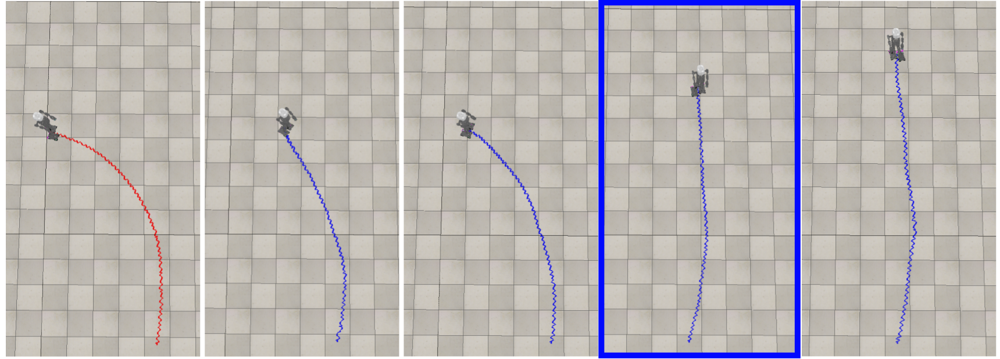
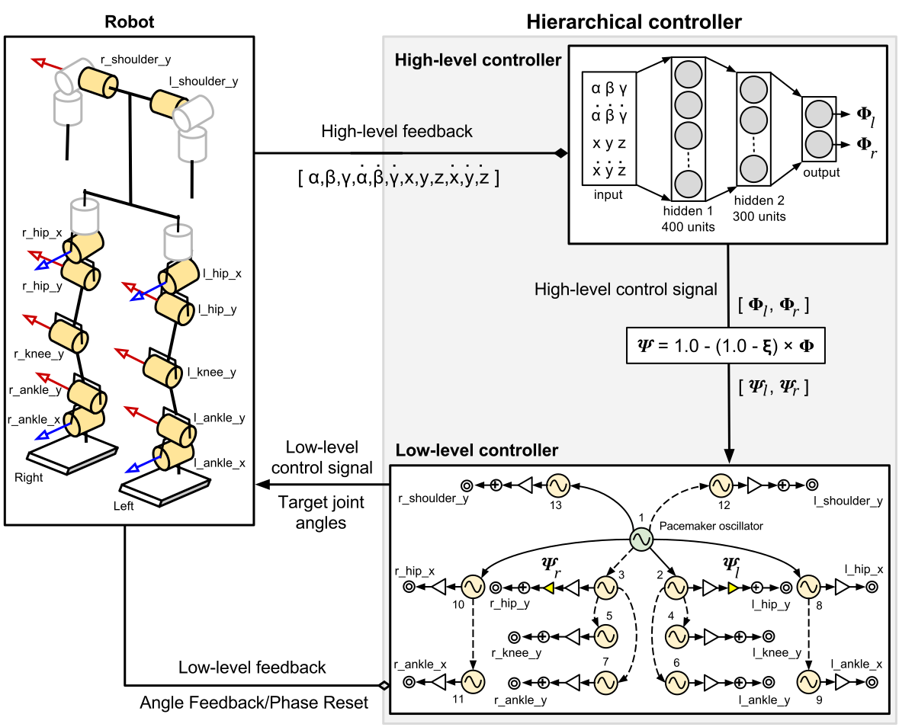

# Hierarchical Control for Bipedal Locomotion using Central Pattern Generators and Neural Networks
(Master of Science Thesis, Intelligent Adaptive Systems, University of Hamburg)

A biologically inspired, hierarchical bipedal locomotion controller for robots. At the lower level, a CPG
network (based on [this work](https://link.springer.com/chapter/10.1007/978-3-319-03413-3_39)) with feedback pathways controls the individual joints. The parameters
of the CPG network are optimized by a genetic algorithm. At the higher level, a
neural network modulates the output of the CPG network in order to optimize the
robot’s movements with respect to an overall objective. In this case, the objective
is to minimize the lateral deviation while walking which may occur due to slippage or due to an imperfect robot model. The neural network is trained
using the [deep deterministic policy gradient algorithm](https://arxiv.org/pdf/1509.02971.pdf) (a deep reinforcement learning algorithm). This work was carried out using the [NICO humanoid robot](https://www.inf.uni-hamburg.de/en/inst/ab/wtm/research/neurobotics/nico.html). 


*The hierarchical controller can minimize the lateral deviation, even in the presence of systematic and non-systematic errors. The robot with the red colored path uses only the CPG network. For the blue-paths the hierarchical controller was used. The highlighted case (4th from left) shows the best performing hyperparameter setup.*

## Paper

The paper presented at ICDL-Epirob 2019 can be viewed [here (official)](https://ieeexplore.ieee.org/document/8850683) or [here (arxiv)](https://arxiv.org/abs/1909.00732).

## Thesis

My MSc thesis can be viewed or downloaded from [here](http://edoc.sub.uni-hamburg.de/informatik/volltexte/2018/237/).

## Video

A small explanation of the architecture and videos of the robot's walking motion can be found [here](https://www.youtube.com/watch?v=4c64rKhj72E).

## Note

* The NICO robot's VREP model and the associated Python API can be found at [this link](https://www.inf.uni-hamburg.de/en/inst/ab/wtm/research/neurobotics/nico.html) under resources. The folders motor_configs, nicomotion and vrep_scenes are empty in this repository but the relevant files should be obtained from the links mentioned above.

## Architecture



## Important folders/modules

1. docker: Scripts for setting up the Docker environment (instructions are provided in a later section of this readme).
2. matsuoka_walk: All necessary scripts for the hierarchical controller (details of important scripts are provided in the next section).
3. motor_configs: Motor configuration files for the NICO robot (empty at present)
4. nicomotion: API for the NICO robot's movements. Some functionality has been added to the default API. (empty at present)
5. plot_scripts: Scripts used for creating the plots used in the thesis
6. plots: Plots generated by the plot scripts.
7. shell_scripts: Utility shell scripts.
8. vrep_scenes: VREP scenes with the NICO robot, used in the experiments.
9. vrep_scripts: Scripts for the VREP simulator

## Important scripts in matsuoka_walk

1. cristiano2014_network.py: Implementation of the Matsuoka CPG network proposed by Cristiano et al.
2. fitness.py: Different types of fitness functions used by the genetic algorithm.
3. ga_2.py: Script used to run the GA for open loop.
4. ga_3.py: Script used to run the GA for angle feedback.
5. ga_5.py: Script used to run the GA for phase reset (with ROS) - This is not used in the final results.
6. ga_5_1.py: Script used to run the GA for phase reset (without ROS).
7. gait_eval.py: Used for the gait evaluation experiments
8. log.py: Provides the infrastructure for logging.
9. matsuoka2011.py: Implementation of a solitary Matsuoka oscillator.
10. matsuoka_ddpg.py: Script for the DDPG algorithm.
11. matsuoka_env.py: Script for creating an OpenAI Gym environment for the DDPG algorithm.
12. monitor.py: Monitors the state of the robot, also used to detect falls.
13. monitor_1.py: Monitoring script with force sensing capability.
14. monitor_eval.py: Monitoring script used for gait evaluation.
15. oscillator*.py: Implementation of the Matsuoka CPG network for various setups. This is used by the GA and DDPG scripts.
16. robots.py: Wrapper scripts for different robots.
17. ros.py: Provides ROS functionality.


## Python Virtual Environment setup (recommended)

1. Set the $HOME location to where the repository can be stored:

    ```bash
    ### Change the path as required
    export HOME=/data/sayantan
    ```

2. Clone the repository (or copy it from the disk)

    ```bash
    cd $HOME
    mkdir -p $HOME/computing/repositories/
    cd $HOME/computing/repositories/
    git clone https://github.com/sayantanauddy/hierarchical_bipedal_controller.git
    ```

3. Download VREP

    ```bash
    cd $HOME
    mkdir $HOME/computing/simulators/
    cd $HOME/computing/simulators/
    # Download
    wget http://coppeliarobotics.com/files/V-REP_PRO_EDU_V3_4_0_Linux.tar.gz
    # Extract
    tar -xvf V-REP_PRO_EDU_V3_4_0_Linux.tar.gz
    ```

3. Copy the VREP scripts

    ```bash
    cd $HOME/computing/repositories/hierarchical_bipedal_controller
    cp start_vrep.sh $HOME/computing/simulators/V-REP_PRO_EDU_V3_4_0_Linux/
    cp remoteApiConnections.txt $HOME/computing/simulators/V-REP_PRO_EDU_V3_4_0_Linux/
    cd $HOME/computing/simulators/V-REP_PRO_EDU_V3_4_0_Linux/
    chmod a+x start_vrep.sh
    ```

4. Create the log folder

    ```bash
    mkdir -p $HOME/.bio_walk/logs/
    ```

5. Create the virtual environment

    ```bash
    cd $HOME
    virtualenv --system-site-packages $HOME/matsuoka_virtualenv
    # Activate the virtual environment
    source $HOME/matsuoka_virtualenv/bin/activate
    ```

6. Add the code location to PYTHONPATH

    ```bash
    export PYTHONPATH=$PYTHONPATH:$HOME/computing/repositories/hierarchical_bipedal_controller/nicomotion
    export PYTHONPATH=$PYTHONPATH:$HOME/computing/repositories/hierarchical_bipedal_controller
    ```

7. Install the dependencies

    ```bash
    # numpy, matplotlib should also be installed
    pip install pypot
    pip install poppy-humanoid
    pip install deap
    pip install --upgrade tensorflow
    pip install keras
    pip install gym
    pip install h5py
    ```

8. Start VREP in a terminal

    ```bash
    cd $HOME/computing/simulators/V-REP_PRO_EDU_V3_4_0_Linux
    ./start_vrep.sh
    ```

9. Run the necessary script. For example ga_3.py to run the genetic algorithm or matsuoka_ddpg.py to run the DDPG training.

## Citation

    @INPROCEEDINGS{auddy2019,
    author={S. {Auddy} and S. {Magg} and S. {Wermter}},
    booktitle={2019 Joint IEEE 9th International Conference on Development and Learning and Epigenetic Robotics (ICDL-EpiRob)},
    title={Hierarchical Control for Bipedal Locomotion using Central Pattern Generators and Neural Networks},
    year={2019},
    volume={},
    number={},
    pages={13-18},
    doi={10.1109/DEVLRN.2019.8850683},
    ISSN={2161-9484},
    month={Aug},}

    @Mastersthesis{AuddyMscThesis2017,
      Title                    = {Hierarchical Control for Bipedal Locomotion using Central Pattern Generators and Neural Networks},
      Author                   = {Auddy, Sayantan},
      school                   = {Universit{\"a}t Hamburg, Hamburg, Germany},
      language                 = {English},
      Year                     = {2017},
      month                    = {Dec}
    }

## Miscelleneous
1. Ros topic for force sensors: '/nico_feet_forces', message type:'std_msgs/String'
2. Force vectors for l1,l2,l3,l4,r1,r2,r3,r4 are concatanated into a single string and published
3. The following were added to .bashrc `source /opt/ros/indigo/setup.bash` and `source ~/catkin_ws/devel/setup.bash`
(Steps 4-6 are needed to run ROS code outside the catkin workspace)
4. VREP specific information:
    * VREP should ideally be invoked using the command LC_NUMERIC=en_US.UTF-8 ./vrep.sh to make sure that '.' is used as the decimal separator and not ','
    * custom remoteApiConnections.txt - Defines the ports for communicating with VREP (see example in vrep_scripts folder).
    * If using ROS with VREP - [Create VREP ROS bridge](http://www.coppeliarobotics.com/helpFiles/en/rosTutorialIndigo.htm)
    

